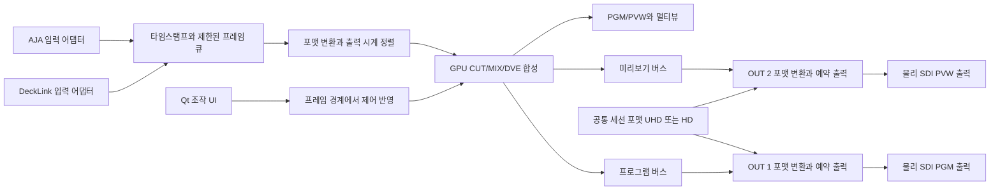

# SW 최소 조건 검토

검토일: 2026-09-09. 상태: 문서 검토 완료 / 실영상 검증 전.

사용자 추가 확정: 동시 입력 4개, 동시 출력 최소 2개. OUT 1은 프로그램(PGM), OUT 2는 미리보기(PVW)입니다. UHD는 2160p59.94, HD는 1080i29.97이며 두 포맷을 동시에 출력하지 않습니다. HD의 29.97i는 초당 약 29.97프레임·59.94필드를 뜻하는 것으로 정리합니다.

## 1. 결론과 범위

요청한 다섯 조건을 충족하는 소프트웨어 스위처는 기술적으로 구현 가능한 방향입니다. **C++20 영상 엔진, Qt 6 UI, Windows용 GPU 합성**을 우선 권장합니다. 구체적인 동시 UHD 채널 수와 지연시간은 카드 설정과 PC에서 실측하기 전까지 보장하지 않습니다.

이번 단계는 조건 확인과 개발 기반 정리입니다. TriCaster 전체 기능, 실제 카드 입출력, DVE 엔진 구현을 완료했다는 의미가 아닙니다.

| 조건 | 확인 결과 | 다음 확정 또는 검증 항목 |
|---|---|---|
| TriCaster 레퍼런스 | 사용자 확인 완료. Preview/Program, 소스 선택, CUT/AUTO, 전환, M/E와 DVE를 참고 | 세부 UI와 첫 버전 기능 범위 |
| 간단한 DVE | GPU에서 PIP·이동·확대축소·크롭·투명도·테두리를 처리하는 설계 가능 | 동시 DVE 레이어 수, 프리셋 수 |
| Java / C++ | 제조사 SDK와 GPU 버퍼 제어를 고려하면 C++ 권장 | Qt UI 채택과 배포 구성 |
| HD / UHD 입출력 | 4입력·최소 2출력(PGM/PVW), UHD 2160p59.94 또는 HD 1080i29.97 선택. 이중 포맷 동시 출력 제외 | 포트 구성, 실영상 검증 |
| AJA / Blackmagic | KONA 5와 DeckLink 8K Pro로 사용자 확인 및 OS 인식 확인 | SDK 장치 조회, 포트 프로파일, 펌웨어, 실제 입출력 |

TriCaster는 제품별로 채널과 기능이 다릅니다. TC1 공식 설명의 UHD 60fps 지원과 TriCaster 기능 문서의 합성·DVE를 기능 참고로 사용하며, 특정 TriCaster 제품과 동일한 성능을 목표값으로 간주하지 않습니다. [TriCaster TC1](https://www.vizrt.com/products/tricaster-tc1/), [TriCaster 기능](https://routing.vizrt.com/products/tricaster/features/)

## 2. 이 PC에서 확인한 장비

아래는 Windows의 장치 및 드라이버 조회 결과입니다. 일련번호나 계정 자격증명은 수집하지 않았습니다.

| 항목 | 확인 결과 |
|---|---|
| 운영체제 | Microsoft Windows 11 Pro, 64비트 |
| GPU | NVIDIA GeForce RTX 5060 |
| Blackmagic 카드 | Blackmagic DeckLink 8K Pro, 장치 상태 OK |
| Blackmagic 드라이버 | 16.4.0.0 |
| AJA 카드 | AJA Kona5, 장치 상태 OK |
| AJA 드라이버 | 18.0.0.1053 |

DeckLink의 여러 하위 장치가 보이는 것은 카드가 여러 장 있다는 뜻이 아닙니다. 현재 장치 이름은 **8K Pro**이며, 별도 모델인 **8K Pro G2**의 HDMI·고프레임률 사양을 보유 카드에 적용하지 않습니다.

OS 장치 상태 OK는 SDK 스트림 개시 성공, 케이블 신호 유무, 카드 간 동기화 또는 UHD 처리 성능을 증명하지 않습니다. 드라이버와 펌웨어 설정은 이 검토에서 변경하지 않았습니다.

## 3. Java와 C++ 비교

Java와 C++ 모두 설치형 데스크톱 프로그램을 만들 수 있습니다. 선택 기준은 프로그램 형태보다 카드 SDK, 버퍼 수명, 프레임 처리 시점과 GPU 연동을 얼마나 직접 제어할 수 있는지입니다.

| 항목 | Java 중심 | C++ 중심 |
|---|---|---|
| 제조사 SDK 연동 | FFM/JNI 또는 별도 네이티브 서비스 연결이 필요 | 네이티브 SDK와 직접 연결하기 편리 |
| UHD 프레임 처리 | 네이티브 메모리를 쓰더라도 언어 경계와 수명 관리 추가 | 프레임 풀·콜백·GPU 자원 수명을 한 계층에서 관리 |
| 일정한 처리 시간 | GC와 스레드 스케줄링을 고려한 설계 필요 | 할당·잠금·대기 제어가 용이. OS와 드라이버 지연은 여전히 존재 |
| UI·업무 로직 | 적합. Java 경험이 많은 팀의 제어 UI 선택지 | Qt로 조작 UI와 네이티브 패키징 가능 |
| 유지보수 | 네이티브 계층이 남으면 두 언어의 빌드와 디버깅 필요 | 메모리·동시성 관리 책임이 큼 |
| 본 프로젝트 권고 | 필요한 경우 후속 제어 클라이언트로 검토 | 실시간 영상 엔진의 우선 선택 |

AJA는 NTV2 SDK를 C/C++ 라이브러리로 설명하며 다른 언어의 직접 지원을 제공하지 않는다고 명시합니다. Java의 FFM은 네이티브 함수와 메모리 접근을 지원하지만 C++ 클래스 인터페이스를 자동으로 Java API로 바꾸지는 않으므로 어댑터 설계가 필요합니다. **C++ 권장은 이러한 연동 구조에 대한 설계 판단**이며 Java로 구현할 수 없다는 뜻은 아닙니다. [AJA NTV2 SDK](https://sdkdocs.aja.com/public/ntv2/18_0_0/index.html), [Oracle FFM](https://docs.oracle.com/en/java/javase/26/core/foreign-function-and-memory-api.html)

권장 구현 후보는 C++20 + CMake, Qt 6/QML, Windows용 Direct3D 11 합성입니다. Qt Quick은 Windows에서 기본적으로 Direct3D 11을 사용합니다. 방송 프레임 출력 시계는 UI 렌더링 및 화면 주사율과 분리합니다. [Qt Quick 렌더러](https://doc.qt.io/qt-6/qtquick-visualcanvas-scenegraph-renderer.html)

## 4. 최소 스위칭·DVE 제안

다음은 사용자 확정 전의 첫 버전 제안입니다.

| 구성 | 제안 |
|---|---|
| 스위칭 | PGM/PVW, CUT, AUTO MIX, 프레임 단위 전환 시간 |
| 기본 합성 | 1 M/E: 전환용 A/B 배경과 최대 2개 DVE 레이어 |
| DVE | PIP, 위치, 크기, 크롭, 평면 회전, 투명도, 테두리 |
| 배치 | PIP·좌우 2분할 프리셋 저장 및 호출 |
| 전환 확장 | 기본 WIPE, DVE 두 상태 사이의 시간 기반 보간 |
| 모니터링 | 소스 썸네일, PGM/PVW, 신호 없음·프레임 누락 표시 |
| 최소 오디오 | SDI 임베디드 48kHz, 스테레오 선택/음소거, 영상 지연 보정 |

TriCaster의 DVE는 M/E 또는 키 레이어에 적용되는 크기·위치·회전 등의 영상 변환을 포함합니다. 이를 참고해 첫 버전을 정의했습니다. [Vizrt DVE 설명](https://www.vizrt.com/blog/how-to-live-stream-to-instagram-with-tricaster/)

이 DVE는 **PC의 GPU 합성 기능**으로 구현합니다. 카드 내부 키어는 모델과 영상 모드별 제약이 있으며, DVE 전체를 대신하는 기능으로 간주하지 않습니다. [DeckLink 키잉 지원 조회](https://sdk-doc.blackmagicdesign.com/decklink-sdk/HighLevel/keying.html)

크로마키, 가상 스튜디오, 3D 페이지 전환, 녹화·스트리밍·미디어 플레이어는 별도 후속 범위로 제안합니다.

## 5. HD / UHD의 의미와 처리

### 확정된 입출력 사양

| 항목 | 사용자 확정 요구와 설계 반영 |
|---|---|
| 동시 입력 | 4개 |
| 동시 출력 | 최소 2개. 첫 구현은 물리 SDI 2출력을 검증하고 확장 가능한 출력 목록으로 설계 |
| UHD 모드 | 3840×2160p59.94, `60000/1001` 프레임/초 |
| HD 모드 | 1920×1080i29.97, `30000/1001` 프레임/초 및 `60000/1001` 필드/초 |
| 출력 포맷 선택 | 세션 단위로 UHD 또는 HD 선택. 모든 활성 출력은 선택된 해상도·주사 방식·프레임률을 사용 |
| 이중 포맷 출력 | UHD와 HD를 동시에 출력하지 않음 |
| 출력 영상 역할 | OUT 1 = PGM, OUT 2 = PVW. 두 영상 버스를 동시에 물리 출력 |

`1080i29.97`은 프레임률 기준 표기이며, 카드나 SDK가 필드률 기준으로 표시하는 `1080i59.94`와 같은 신호를 뜻합니다. 내부에서는 유리수와 주사 방식을 각각 저장하고, 이를 `1080p29.97` 또는 `1080p59.94`로 잘못 매핑하지 않습니다.

PGM과 PVW는 같은 포맷으로 서로 다른 영상을 출력할 수 있어야 합니다. 두 출력의 합성 대상·프레임 버퍼·예약 큐를 분리하고 공통 세션 시계로 관리합니다. 미리보기 소스와 DVE 변경이 TAKE/AUTO 전 PGM에 반영되지 않도록 상태도 분리합니다. 소프트웨어 멀티뷰 창은 물리 출력 수에 포함하지 않습니다.

### 변환 및 처리 설계

| 항목 | 설계 제안 또는 확인 범위 |
|---|---|
| 혼합 해상도 입력 | 두 출력 포맷의 동시 사용을 제외해도, HD/UHD 혼합 입력은 별도 처리 항목으로 유지. 최소 실기 시험은 각 모드의 동종 4입력으로 시작 |
| HD 입력 처리 | 인터레이스 입력의 필드 순서와 시간 차이를 보존하는 디인터레이스 경로 |
| HD 출력 처리 | 필드 시각별 합성 결과로 1080i 출력을 구성. 움직이는 DVE의 시간 해상도를 유지 |
| 기타 포맷 | 50/60p, HD 프로그레시브 등은 이번 필수 지원 표에서 제외하고 후속 확장으로 관리 |
| 색 처리 | 첫 버전 SDR Rec.709, SDI YCbCr 4:2:2 10비트 경로를 목표로 검증 |
| UHD 전송 | 2160p59.94 4:2:2에는 single-link 12G-SDI를 우선 검토 |
| HD 전송 | 1080i59.94 HD-SDI 모드와 케이블 경로 검증 |
| 포맷 전환 | 세션 정지 후 모든 출력을 함께 재구성하는 방식을 우선 제안. 운용 중 무중단 포맷 전환은 필수 범위에 포함하지 않음 |

HD 모드에서는 내부 합성 시계를 `60000/1001`회/초로 운용하고, 서로 다른 두 시각의 결과에서 상·하 필드를 취해 SDK 프레임 버퍼를 구성하는 경로를 제안합니다. 전송 프레임률은 `30000/1001`이며 한 버퍼에 두 필드를 담습니다. 단일 29.97p 영상을 두 필드로 나누는 것만으로 처리하면 움직임의 시간 해상도가 줄어들므로 수신 계측기로 필드 순서와 움직임을 검증합니다.

동기화되지 않은 입력은 출력 시계에 맞춰 프레임을 선택하는 버퍼가 필요합니다. 서로 다른 프레임률을 맞추는 첫 방식은 반복/드롭이며, 움직임의 부드러움까지 동일하게 보장하는 고급 보간은 별도 범위입니다. 외부 기준 신호가 있어도 임의의 혼합 입력 변환이 자동 해결되지는 않습니다.

색 범위, Rec.709/Rec.2020 및 HDR 메타데이터를 명시적으로 관리해야 합니다. 첫 버전에서 지원하지 않는 HDR 입력은 감지 후 안내하며 SDR로 잘못 해석하지 않도록 설계합니다.

## 6. 보유 카드로 구성하는 방법

**DeckLink 8K Pro**: SDK 문서는 4개의 half-duplex 하위 장치 프로파일과 SDI 포트 대응을 설명합니다. 이 모드에서 포트 하나는 입력 또는 출력으로 사용됩니다. 따라서 SDI 네 단자에 입력 4개를 할당한 뒤 같은 카드에서 독립 SDI PGM까지 추가할 수 있다고 계산하면 안 됩니다. 프로파일 변경 시 다른 스트림에도 영향이 있으므로 초기 장치 조회 단계에서 확인합니다. [DeckLink 장치 프로파일](https://sdk-doc.blackmagicdesign.com/decklink-sdk/HighLevel/profiles.html)

**AJA KONA 5**: HD/UHD와 12G-SDI 입출력을 지원합니다. SDK에서는 retail/OEM 등 펌웨어 성격에 따라 내부 프레임스토어와 사용 가능한 기능이 달라짐을 설명합니다. 네 단자를 항상 독립 UHD 4채널로 가정하지 않고, 실제 장치 ID·펌웨어·라우팅 능력을 먼저 조회합니다. [KONA 5](https://www.aja.com/products/kona-5), [AJA 장치 설명](https://sdkdocs.aja.com/public/ntv2/dev/d0/d53/ntv2devices.html)

AJA의 개발자 비교표는 KONA 5의 최대 SDI 출력 4개와 독립 프레임스토어 4개를 명시하고, SDK 장치 문서는 retail과 OEM 펌웨어의 구조 차이를 설명합니다. 이를 근거로 KONA 5의 **UHD 2출력을 조사할 타당성은 있으나**, 현재 PC의 펌웨어에서 바로 가능하다고 확정하지 않습니다. pass-through나 동일 프레임스토어의 복제 출력을 독립 PGM/PVW 두 출력으로 계산하지 않습니다. [AJA KONA 개발자 비교](https://www.aja.com/comparison/kona), [KONA 5 펌웨어별 장치 설명](https://sdkdocs.aja.com/public/ntv2/current/d0/d53/ntv2devices.html)

| 시험 구성 | 목적 | 조건 |
|---|---|---|
| DeckLink 2입력 + 1출력 | 초기 CUT/MIX와 지연을 확인하는 중간 개발 시험 | 최종 4입력·최소 2출력 요구의 완료 기준으로 사용하지 않음 |
| DeckLink 4입력 + KONA 5 PGM/PVW 2출력 | 우선 조사할 최종 포트 구성 | 같은 포맷의 서로 다른 두 영상 동시 출력, KONA 펌웨어·프레임스토어·예약 출력 검증 |
| DeckLink 3입력·1출력 + KONA 5 1입력·1출력 | 카드 간 분산 대안 | KONA의 동시 캡처와 독립 합성 출력 가능 여부부터 검증. 단순 입력 pass-through로 대체하지 않음 |

첫 번째 최종 구성에서는 DeckLink SDI 1~4를 입력 후보로, KONA의 SDK가 제공하는 두 개의 적합한 출력 채널을 OUT 1/2 후보로 둡니다. KONA의 물리 포트 번호는 펌웨어 조회 전 하드코딩하지 않습니다. 두 대안 모두 실제 요구 모드에서 검증되지 않으면 추가 또는 대체 I/O 장비를 별도 검토하며, 현재는 구매·펌웨어 변경을 수행하지 않습니다.

두 제조사의 카드를 한 PC에서 사용하는 구조는 공통 입출력 인터페이스와 제조사별 어댑터로 설계할 수 있습니다. OS가 두 카드를 인식했다는 사실만으로 동시 스트림의 안정성을 단정하지 않습니다.

## 7. 권장 영상 경로

제조사 SDK 콜백은 프레임을 큐에 넘기고 빠르게 반환합니다. 합성·파일 접근·UI 갱신을 콜백 안에서 수행하지 않습니다. 버퍼 수를 제한하고 과부하 정책을 정의해 지연이 무한히 늘어나지 않도록 합니다. 출력은 UI의 타이머가 아닌 카드의 예약 재생 또는 이에 대응하는 SDK 기능을 기준으로 설계합니다.

GPU 직접 전송은 카드·GPU·드라이버·SDK 경로별 지원을 검증한 뒤 적용합니다. RTX 5060이라는 이름만으로 GPUDirect 또는 모든 전송 경로의 무복사 처리를 보장하지 않습니다. 기본적인 CPU 메모리 경유 경로도 측정 대상입니다. [Blackmagic SDK 플랫폼 및 GPU 연동](https://sdk-doc.blackmagicdesign.com/decklink-sdk/section1.html)

용량 감각을 위한 계산: UHD 59.94p의 8비트 YUV 4:2:2 활성 영상은 한 스트림 약 0.99GB/s, v210은 약 1.33GB/s입니다. 후자는 3840×2160×(8/3)×(60000/1001) 계산이며 오디오·ANC·추가 복사 등은 제외합니다. 4입력 v210은 약 5.3GB/s, PGM/PVW 2출력은 약 2.65GB/s입니다. GPU 전송과 두 버스의 합성도 추가됩니다. 이는 메모리 데이터량의 추정이며 PCIe의 양방향 부하를 단순 합산한 한 방향 대역폭 요구값이 아닙니다.

## 8. 아직 필요한 결정

- Genlock 사용 여부와 서로 다른 출력의 시간 정렬 요구.
- HD/UHD 혼합 입력을 첫 버전에서 필수 검증할지.
- DVE 2레이어 제안의 적합성, 허용 지연시간과 연속 운용 시간.
- Windows를 첫 지원 운영체제로 확정할지.

GitHub는 사용자가 생성한 공개 저장소 [coremon91/sw](https://github.com/coremon91/sw)를 사용합니다. 위 미확정 사항은 이미 정해진 사용자 요구로 취급하지 않습니다.
